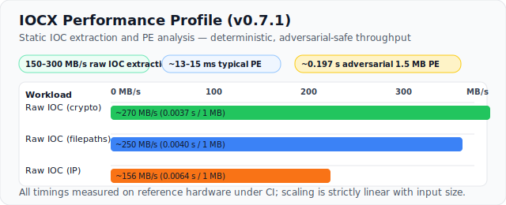

# Official IOCX Project

This is the **original IOCX engine** for static IOC extraction and PE analysis.
Any other repositories using the name "iocx" are **not affiliated** with this project.

- PyPI: [https://pypi.org/project/iocx/](https://pypi.org/project/iocx/)
- Github: [https://github.com/iocx-dev/iocx](https://github.com/iocx-dev/iocx)
- Website: [https://iocx.dev/](https://iocx.dev/)

<p align="center">
  <a href="https://pypi.org/project/iocx/">
    
  </a>
  
  
  
  <a href="https://github.com/iocx-dev/iocx/blob/main/LICENSE">
    
  </a>
  <a href="https://github.com/iocx-dev/iocx/actions">
    
  </a>
  <a href="docs/testing/">
    
  </a>
  <a href="docs/performance.md">
    
  </a>
</p>

<p align="center">
  
</p>
<p align="center">
  <sub>Static IOC extraction from a PE file using the IOCX CLI</sub>
</p>

## IOCX — Static IOC Extraction for Binaries, Text, and Artifacts

**Fast, safe, deterministic IOC extraction for DFIR, SOC automation, and large-scale threat analysis.**

IOCX is a lightweight, extensible engine for extracting Indicators of Compromise (IOCs) and structural metadata using **pure static analysis**. No execution. No sandboxing. No risk.

Built for:

- DFIR workflows
- SOC automation
- Threat-intel pipelines
- CI/CD security checks
- Large‑scale batch processing

IOCX is a core component of the MalX Labs ecosystem for scalable, modern threat‑analysis tooling.

## Why IOCX?

IOCX is designed for environments where **safety, determinism, and automation** matter. Unlike extractors that operate only on raw text, IOCX includes:

- Binary‑aware static analysis
- A plugin-friendly rule system
- A stable JSON schema suitable for pipelines and long-term integrations

## Key advantages

- **Static‑only design** — never executes untrusted code
- **Binary parsing** — PE-aware extraction with section analysis and structural heuristics
- **Analysis level** — basic, deep, and full for performance-tuned workflows
- **Deterministic behaviour** — stable output and predictable performance
- **Extensible rule engine** — custom detectors, parsers, and plugins
- **Consistent JSON schema** — clean integration with SIEM/SOAR
- **Low dependency footprint** — safe for enterprise environments
- **Pipeline-ready** — fast start‑up, fast throughput

## What IOCX *Is Not*

To avoid confusion:

- Not a sandbox
- Not a behavioural analysis tool
- Not an emulator
- Not an enrichment engine

IOCX is **static extraction only**, by design.

## Use Cases

### SOC & Incident Response
- Extract indicators from emails, alerts, or analyst clipboard text
- Parse IOCs from reports into structured JSON
- Safely inspect malware samples without execution

### Threat Intelligence Processing
- Normalise indicators from feeds
- Batch‑process unstructured text
- Build enrichment pipelines on top of deterministic output

### CI/CD & DevSecOps
- Scan binaries for embedded indicators before publishing
- Integrate IOC extraction into automated checks
- Detect accidental inclusion of URLs or addresses in builds

### Bulk Automation & Scripting
- Pipe logs or artifacts through IOCX
- Use the Python API for ETL or batch workflows
- Extend with custom detectors for internal patterns

## Version Highlights

### v0.7.1 — Adversarial Heuristics Expansion & Parser Hardening

v0.7.1 strengthens IOCX’s PE analysis layer with **six new structural heuristics** and introduces a broad adversarial corpus to validate them. This release focuses on robustness, determinism, and resilience against malformed binaries and hostile IOC‑like strings.

- **New PE heuristics added**
  - Section overlap detection
  - Section alignment validation
  - Optional‑header consistency checks
  - Entrypoint → section mapping validation
  - Data‑directory anomaly detection
  - Import‑directory validity checks
- **Expanded adversarial PE corpus**: malformed imports, corrupted RVAs, invalid optional headers, truncated Rich headers, overlapping sections, franken‑PE hybrids
- **Adversarial fixtures for *all* IOC categories**: crypto, homoglyph domains, malformed URLs, broken IPs, long paths, noisy hashes, invalid base64, deceptive emails
- **Deterministic, JSON‑safe output**: all new samples snapshot‑validated
- **No behavioural changes to extractors**: static‑only design preserved

This release improves IOCX’s **structural awareness**, **error resilience**, and **adversarial coverage**.

### v0.7.0 — Deterministic Heuristics & Adversarial Testing Foundation

- Deterministic heuristics: anti‑debug APIs, TLS anomalies, packer‑like behaviour, RWX sections, import anomalies.
- Adversarial testing: initial Layer-3 samples validating heuristics, entropy analysis and IOC extraction.
- Contract testing: deterministic snapshots for sections, imports, heuristics, and IOCs.
- Bug fix: resolved a crash caused by non‑UTF8 Rich Header bytes
- Docs: new deterministic‑output section and adversarial sample appendices.

### v0.6.0 — Stable Output Schema, Deterministic PE Metadata, Contract‑Safe Analysis Levels

- Fully stable JSON schema
- Strict structural guarantees for `iocs`, `metadata`, and `analysis`
- Normalised PE metadata for deterministic output
- All IOC categories always present
- Formalised analysis‑level behaviour
- Snapshot‑contract tests to prevent schema drift

### v0.5.0 — Analysis Levels, PE Section Analysis, Obfuscation Hints

- New analysis‑level system
- PE structural analysis: section layout, raw/virtual sizes, entropy
- Obfuscation heuristics
- Clean, stable JSON schema

### v0.4.0 — Plugin Architecture, Custom Detectors, Cleaner Internals

- Plugin‑ready rule engine
- Unified detection flow
- Support for custom regex detectors

### v0.3.0 — Stronger Architecture, New Crypto IOC Detection

- Ethereum & Bitcoin wallet detection

### v0.2.0 — High‑Reliability IP Detection

- Major improvements to IPv4/IPv6 extraction

## **Performance Profiles**

IOCX has **three distinct performance profiles**, each reflecting a different class of workload.
This separation gives DFIR, SOC, and CI/CD users a realistic understanding of how the engine behaves across text, normal binaries, and adversarial samples.

<p align="center">
  <a href="docs/performance.md">
    
  </a>
</p>

### **1. Raw IOC Extraction (Text, Logs, Buffers)**

**Fast path — no PE parsing, no heuristics.**

These benchmarks measure the raw detectors operating on flat buffers.
They represent the maximum throughput of the IOC extraction engine.

| Detector       | 1 MB Time | Throughput    |
|----------------|-----------|---------------|
| **Crypto**     | 0.0037 s  | **~270 MB/s** |
| **Filepaths**  | 0.0040 s  | **~250 MB/s** |
| **IP**         | 0.0064 s  | **~156 MB/s** |

**Summary:**
- **~150–300 MB/s** sustained throughput
- **~0.003–0.006 s per MB**
- Linear scaling from 100 KB → 1.5 MB
- Worst‑case blobs (IPv6, ETH‑like, deep UNIX paths) remain sub‑millisecond to low‑millisecond

This is ideal for SOC pipelines, log processing, and bulk text extraction.

### **2. Typical PE Files (~39 KB)**

**Normal Windows executables with standard imports and minimal data.**

Represents the cost of full PE parsing + IOC extraction on a clean, realistic binary.

- **Typical PE:** 0.0132 s
- **Typical PE (with heuristics):** 0.0153 s
- **Throughput:** **~6–15 MB/s** (full engine)
- **Heuristics:** usually none or minimal

This profile reflects what IOCX will see in CI/CD pipelines, internal tooling, and benign executables.

### **3. Adversarial Dense PE (1.5 MB)**

**Worst‑case full‑engine workload.**

A synthetic PE designed to stress:

- section scanning
- RVA mapping
- import/TLS analysis
- heuristic engine
- IOC extraction across large, dense regions

- **Dense PE:** 0.1977 s
- **Throughput:** **~7.6 MB/s**
- **Triggers:** TLS anomalies, structural anomalies, anti‑debug patterns

This demonstrates IOCX’s stability and predictability under adversarial conditions.

### **4. Full Engine (Non‑PE) End‑to‑End Path**

For completeness, the full engine path on raw data (including overhead):

- **1 MB end‑to‑end:** 0.0411 s

This includes engine setup, routing, and output formatting — not just detector throughput.

### **Summary Table**

| Workload Type                      | Size   | Time     | Throughput    | Notes                     |
|------------------------------------|--------|----------|---------------|---------------------------|
| **Raw IOC extraction (crypto)**    | 1 MB   | 0.0037 s | **~270 MB/s** | Fast path                 |
| **Raw IOC extraction (filepaths)** | 1 MB   | 0.0040 s | **~250 MB/s** | Fast path                 |
| **Raw IOC extraction (IP)**        | 1 MB   | 0.0064 s | **~156 MB/s** | Fast path                 |
| **Typical PE**                     | 39 KB  | 0.0132 s | **6–15 MB/s** | Normal binaries           |
| **Typical PE + heuristics**        | 39 KB  | 0.0153 s | **6–15 MB/s** | Full analysis             |
| **Adversarial dense PE**           | 1.5 MB | 0.1977 s | **~7.6 MB/s** | Worst‑case                |
| **Full engine (non‑PE)**           | 1 MB   | 0.0411 s | —             | Includes routing/overhead |

### **Interpretation**

- IOCX is **extremely fast** on raw text and log data (150–300 MB/s).
- IOCX is **fast and predictable** on normal Windows binaries (~13–15 ms).
- IOCX remains **stable and linear** even on adversarial PE files designed to stress the engine.
- No pathological slowdowns, no exponential behaviour, no regex backtracking stalls.

This three‑tier model provides a realistic, defensible performance profile for DFIR, SOC automation, and CI/CD environments.

## Example JSON Output

<details>
<summary><strong>Show Example JSON Output</strong></summary>
<br>

```json
$ iocx chaos_corpus.json
{
  "file": "examples/samples/structured/chaos_corpus.json",
  "type": "text",
  "iocs": {
    "urls": [
      "http://[2001:db8::1]:443"
    ],
    "domains": [],
    "ips": [
      "2001:db8::1",
      "10.0.0.1",
      "192.168.1.10",
      "fe80::dead:beef%eth0",
      "1.2.3.4",
      "fe80::1%eth0",
      "192.168.1.110",
      "fe80::1%eth0fe80",
      "::2%eth1",
      "2001:db8::"
    ],
    "hashes": [],
    "emails": [],
    "filepaths": [],
    "base64": [],
    "crypto.btc": [],
    "crypto.eth": []
  },
  "metadata": {}
}

```

</details>
<details>
<summary><strong>Chaos Corpus: Input → Extracted Output → Explanation</strong></summary>
<br>

| Input                                 | Extracted Output                         | Explanation                                 |
|---------------------------------------|------------------------------------------|---------------------------------------------|
| fe80::dead:beef%eth0/garbage          | fe80::dead:beef%eth0                     | Salvaged valid IPv6, junk ignored.          |
| xxx192.168.1.10yyy                    | 192.168.1.10                             | IPv4 inside junk text.                      |
| DROP:client=10.0.0.1;;;ERR            | 10.0.0.1                                 | IPv4 from noisy log field.                  |
| [2001:db8::1]::::443                  | 2001:db8::1                              | IPv6 and IPv6+port extracted.               |
|                                       | 2001:db8::1:443                          |                                             |
| GET http://[2001:db8::1]:443/index    | http://[2001:db8::1]:443                 | URL with IPv6 parsed correctly.             |
| udp://[fe80::1%eth0]::::53            | fe80::1%eth0                             | Concatenated IPv6 split up.                 |
| 192.168.1.110.0.0.1                   | 192.168.1.110                            | Combined IP segment salvaged.               |
| fe80::1%eth0fe80::2%eth1              | fe80::1%eth0fe80, ::2%eth1               | Concatenated IPv6 split up.                 |
| 2001:db8::12001:db8::2                | 2001:db8::                               | Longest valid IPv6 prefix found.            |
| 256.256.256:256                       | —                                        | Invalid indicator ignored.                  |
</details>

## Project Identity & Naming

IOCX is the name of the official static IOC extraction engine published on:

- **PyPI**: https://pypi.org/project/iocx/
- **GitHub**: https://github.com/iocx-dev/iocx

The IOCX name, branding, and project identity refer **exclusively** to this project and its associated packages, documentation, and releases.

To protect users from confusion and maintain a healthy ecosystem:

### What third‑party projects may NOT do

- Use `iocx` as the name of their repository
- Publish tools named “iocx” that are not this project
- Present themselves as the creators or maintainers of IOCX
- Use the PyPI badge for the official `iocx` package
- Imply official affiliation or endorsement without permission

These actions mislead users and violate the identity of the project.

### Allowed & encouraged

Third‑party tools, plugins, and integrations are welcome.
To avoid confusion, they should follow this naming pattern:

- `iocx-<plugin-name>`
- `iocx-plugin-<feature>`
- `iocx-extension-<name>`

Examples:

- `iocx-osint-enricher`
- `iocx-detector-custom`

### Why this matters

IOCX is used in DFIR, SOC automation, CI/CD pipelines, and threat‑intel workflows.
Clear naming ensures:

- Users know which tool is the **official** IOCX engine
- Third‑party tools are discoverable without causing confusion
- The ecosystem grows in a structured, healthy way

If you are building something that integrates with IOCX and want guidance on naming or attribution, feel free to open an issue

## Official IOCX Repositories

- Core Engine: https://github.com/iocx-dev/iocx
- Plugins Meta‑Repo: https://github.com/iocx-dev/iocx-plugins
- Documentation: https://github.com/iocx-dev/iocx/tree/main/docs/specs
- PyPI Package: https://pypi.org/project/iocx/

## Features

### IOC Extraction

- URLs
- Domains
- IPv4 / IPv6 addresses
- File paths (Windows, Linux, UNC, env-vars)
- Hashes (MD5 / SHA1 / SHA256 / SHA512 / Generic Hex)
- Email addresses
- Base64 strings
- Crypto wallets (Ethereum / Bitcoin)

### Binary-aware Static Analysis

- Windows PE files (`.exe`, `.dll`)
- Extracted strings from binaries
- Imports, sections, resources, metadata
- **Analysis levels:**
  - `basic` - section layout + entropy
  - `deep` - adds obfuscation heuristics
  - `full` - extended analysis stub (*future-ready*)

### Performance & Caching

- Fast startup and throughput
- Optional caching for repeated scans
- Suitable for CI/CD and large batch workflows

### Developer‑Friendly

- Clean, stable JSON output
- CLI + Python API
- Modular, extensible rule system
- Minimal dependency footprint

### Security‑First

- Zero malware execution
- Safe for untrusted input
- Deterministic behaviour for pipelines

### Why Static Only?

Static analysis ensures **safety**, **determinism**, and **CI‑friendly operation**. No sandboxing, no execution, and no risk of triggering malware behaviour.

## Output Schema (v0.6.0)

IOCX v0.6.0 defines a stable, deterministic JSON schema designed for DFIR, SOC automation, and threat‑intel pipelines. The schema is intentionally simple, predictable, and safe for long‑term integrations.

The top‑level structure contains three blocks:

- `iocs` — extracted indicators
- `metadata` — structural information about the artifact
- `analysis` — optional deeper inspection depending on analysis level

This structure is identical across all input types, with PE‑specific fields populated only when applicable.

### IOC Categories

The `iocs` block always contains the same keys, regardless of analysis level:

- `urls`
- `domains`
- `ips`
- `hashes`
- `emails`
- `filepaths`
- `base64`
- `crypto.btc`
- `crypto.eth`

Each category is always an array. Empty categories are returned as empty arrays to ensure predictable downstream parsing.

### Metadata Categories

The metadata block contains structural information about the file. For PE files, this includes:

- Imports and import details
- Sections
- Resources and resource strings
- TLS directory
- Header and optional header
- Rich header
- Signatures

These fields are always present, even when empty. Metadata is **independent of analysis level** and is always returned in full.

### Analysis Levels

The `analysis` block is the only part of the schema that changes based on the selected analysis level.

- **basic** — section layout + entropy
- **deep** — adds obfuscation heuristics
- **full** — adds extended metadata summaries

This tiered design allows users to trade off performance vs. depth without changing their downstream parsing logic.

### Deterministic Output

IOCX v0.6.0 guarantees:

- Stable keys
- Stable types
- No volatile values in minimal modes
- Deterministic behaviour across runs and platforms

This makes IOCX safe for SIEM/SOAR ingestion, CI/CD pipelines, and large‑scale batch processing.

### Schema stability

IOCX guarantees a stable JSON schema, not a guaranteed ordering of keys within objects. JSON objects are defined as unordered maps, so consumers should rely on field presence and structure rather than positional ordering. All fields, types, and structural relationships remain consistent across versions, even if internal key order changes.

## Quickstart

### Install
```bash
pip install iocx
```

### Extract IOCs from a file
```bash
iocx suspicious.exe
```

### Extract from text
```bash
echo "Visit http://bad.example.com" | iocx -
```

### Extract from a log file
```bash
iocx alerts.log
```

### Enable PE analysis
```bash
iocx suspicious.exe -a
```
Or choose a specific level:
```bash
iocx suspicious.exe -a basic
iocx suspicious.exe -a deep
iocx suspicious.exe -a full
```

### Python API
```python
from iocx.engine import Engine

engine = Engine()
results = engine.extract("suspicious.exe")
print(results)
```
<details>
<summary><strong>Show Example JSON Output</strong></summary>

<br>

```json
{
  "file": "suspicious.exe",
  "type": "PE",
  "iocs": {
    "urls": [],
    "domains": [],
    "ips": [],
    "hashes": [],
    "emails": [],
    "filepaths": [
      "C:\\Windows\\System32\\cmd.exe",
      "D:\\Temp\\payload.bin",
      "E:/Users/Bob/AppData/Roaming/evil.dll",
      "F:\\Program Files\\SomeApp\\bin\\run.exe",
      "C:\\Users\\Alice\\Desktop\\notes.txt",
      "Z:\\Archive\\2024\\logs\\system.log",
      "\\\\SERVER01\\share\\dropper.exe",
      "\\\\192.168.1.44\\c$\\Windows\\Temp\\run.ps1",
      "\\\\FILESRV\\public\\docs\\report.pdf",
      "\\\\NAS01\\data\\backups\\2024\\config.json",
      "/usr/bin/python3.11",
      "/etc/passwd",
      "/var/lib/docker/overlay2/abc123/config.v2.json",
      "/tmp/x1/x2/x3/x4/x5/script.sh",
      "/opt/tools/bin/runner",
      "/home/alice/.config/evil.sh",
      ".\\payload.exe",
      "..\\lib\\config.json",
      "./run.sh",
      "../bin/loader.so",
      ".\\scripts\\install.ps1",
      "%APPDATA%\\Microsoft\\Windows\\Start Menu\\Programs\\Startup\\evil.lnk",
      "%TEMP%\\payload.exe",
      "%USERPROFILE%\\Downloads\\file.txt",
      "$HOME/.config/evil.sh",
      "$HOME/bin/run.sh",
      "$TMPDIR/cache/tmp123.bin",
      "C:\\Windows\\Temp\\payload.bin",
      "/home/alice/.config/evil"
    ],
    "base64": [],
    "crypto.btc": [],
    "crypto.eth": []
  },
  "metadata": {
    "file_type": "PE",
    "imports": [
      "KERNEL32.dll",
      "msvcrt.dll"
    ],
    "sections": [
      ".text",
      ".data",
      ".rdata",
      ".pdata",
      ".xdata",
      ".bss",
      ".idata",
      ".CRT",
      ".tls",
      ".rsrc",
      ".reloc"
    ],
    "resource_strings": [
      "C:\\Windows\\System32\\cmd.exe",
      "\\\\SERVER01\\share\\dropper.exe",
      "/home/alice/.config/evil.sh@%APPDATA%\\Microsoft\\Windows\\Start Menu\\Programs\\Startup\\evil.lnk"
    ]
  },
  "analysis": {
    "sections": [
      {
        "name": ".text",
        "raw_size": 7168,
        "virtual_size": 6712,
        "characteristics": 1610612832,
        "entropy": 5.790750971742716
      },
      {
        "name": ".data",
        "raw_size": 512,
        "virtual_size": 464,
        "characteristics": 3221225536,
        "entropy": 2.094202310841767
      },
      {
        "name": ".rdata",
        "raw_size": 3584,
        "virtual_size": 3408,
        "characteristics": 1073741888,
        "entropy": 4.545752258688727
      },
      {
        "name": ".pdata",
        "raw_size": 1024,
        "virtual_size": 540,
        "characteristics": 1073741888,
        "entropy": 2.327719716055491
      },
      {
        "name": ".xdata",
        "raw_size": 512,
        "virtual_size": 488,
        "characteristics": 1073741888,
        "entropy": 4.1370410751038245
      },
      {
        "name": ".bss",
        "raw_size": 0,
        "virtual_size": 384,
        "characteristics": 3221225600,
        "entropy": 0.0
      },
      {
        "name": ".idata",
        "raw_size": 1536,
        "virtual_size": 1472,
        "characteristics": 3221225536,
        "entropy": 3.7542599473501452
      },
      {
        "name": ".CRT",
        "raw_size": 512,
        "virtual_size": 96,
        "characteristics": 3221225536,
        "entropy": 0.2718922950073886
      },
      {
        "name": ".tls",
        "raw_size": 512,
        "virtual_size": 16,
        "characteristics": 3221225536,
        "entropy": 0.0
      },
      {
        "name": ".rsrc",
        "raw_size": 512,
        "virtual_size": 416,
        "characteristics": 1073741888,
        "entropy": 2.6481096709923975
      },
      {
        "name": ".reloc",
        "raw_size": 512,
        "virtual_size": 188,
        "characteristics": 1107296320,
        "entropy": 2.2248162937403557
      }
    ],
    "obfuscation": [
      {
        "value": "abnormal_section_layout_virtual_only",
        "start": 0,
        "end": 0,
        "category": "obfuscation_hint",
        "metadata": {
          "section": ".bss",
          "raw_size": 0,
          "virtual_size": 384
        }
      }
    ]
  }
}

```

</details>

## Architecture
```plaintext

iocx/
│
├── examples/        # Sample files + generators
├── docs/            # Detector contracts, overlap suppression rules, and plugin authoring guidelines
├── tests/           # Unit, integration, fuzz, robustness, contract, and performance tests
├── iocx
    ├── detectors/   # Regex-based IOC detectors
    ├── parsers/     # PE parsing, string extraction
    ├── plugins/     # Plugin API and registry
    ├── cli/         # Command-line interface
    ├── analysis/    # PE static-analysis modules

```

The engine is intentionally modular so components can be extended or replaced easily.

## Extending IOCX

See `docs/specs/` for:

- Detector contracts
- Overlap suppression rules
- Plugin authoring guidelines

## Safe Testing (No Malware Required)

All test samples are:

- Synthetic
- Benign
- Publicly safe (EICAR, GTUBE)
- Designed to avoid accidental malware handling

## Performance Guarantees

IOCX is engineered for high‑throughput, low‑latency analysis across normal, edge‑case, and adversarial inputs.
We maintain strict performance thresholds enforced in CI to ensure the engine remains fast and predictable across releases.

See [Performance Guarantees](/docs/performance.md)

## Contributing

We welcome:

- New IOC detectors
- Parser improvements
- Bug reports
- Documentation updates
- Synthetic test samples

See CONTRIBUTING.md for full guidelines.

## Security

If you discover a security issue, do not open a GitHub issue.
Please follow the instructions in SECURITY.md.

## License

Licensed under the MIT License. See LICENSE for details.


*The IOCX name and project identity refer exclusively to the IOCX engine maintained under the iocx-dev organisation*
