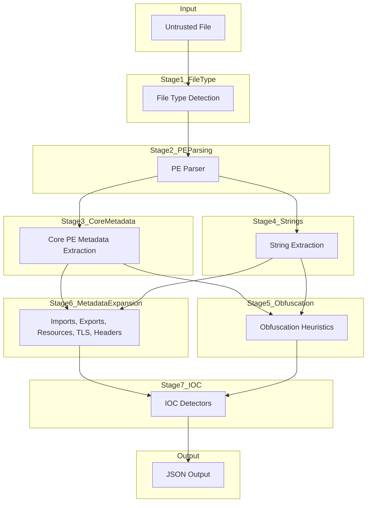

# IOCX PE Analysis Pipeline

IOCX includes a deterministic, static, offline analysis pipeline for Portable Executable (PE) files.
The pipeline is designed to safely process untrusted binaries without executing them, unpacking them, or performing any dynamic analysis.

This document describes the full PE pipeline as of v0.6.0, including:

- PE parsing
- metadata extraction
- obfuscation heuristics
- deep metadata analysis
- IOC detection

It also outlines how future versions (v0.7.0+) will extend this pipeline with behavioural heuristics.

## 1. Pipeline Overview

The IOCX PE pipeline consists of the following ordered stages:

- File Type Detection
- PE Parsing
- Core Metadata Extraction
- String Extraction
- Obfuscation Heuristics (v0.5.0)
- PE Metadata Expansion (v0.6.0)
- IOC Detection
- Output Assembly

Each stage is deterministic, offline, and safe to run on malicious or malformed binaries.



## 2. File Type Detection

IOCX uses signature‑based detection (via python-magic) to determine whether a file is a PE.

- No execution
- No sandboxing
- No heuristics
- Purely structural detection

If the file is not a PE, the PE pipeline is skipped.

## 3. PE Parsing

IOCX uses pefile to parse the binary safely:

- DOS header
- NT headers
- Optional header
- Section table
- Data directories

All parsing is wrapped in defensive exception handling to prevent crashes on malformed samples.

No dynamic loading or execution occurs.

## 4. Core Metadata Extraction

The engine extracts a minimal set of metadata used by downstream components:

- section names
- section sizes
- virtual vs raw size
- entry point
- timestamp
- machine type
- characteristics flags

This metadata is passed to both the obfuscation heuristics (v0.5.0) and the deep metadata module (v0.6.0).

## 5. String Extraction

IOCX extracts printable ASCII and UTF‑16LE strings from:

- `.text`
- `.rdata`
- `.data`
- entire file (fallback)

Strings are used by:

- obfuscation heuristics
- IOC detectors
- future anti‑debug heuristics (v0.7.0)

Extraction is deterministic and bounded.

## 6. Obfuscation Heuristics (v0.5.0)

Introduced in v0.5.0, this module provides lightweight static hints about potential packing or obfuscation.

Heuristics include:

- suspicious section names (.upx, .aspack, .mpress, etc.)
- high‑entropy sections
- abnormal section layout
- basic string‑obfuscation patterns

### Output

Each heuristic emits a structured Detection object:

```json
{
  "type": "obfuscation_hint",
  "value": "high_entropy_section",
  "metadata": {
    "section": ".upx0",
    "entropy": 7.89,
    "threshold": 7.2
  }
}
```

These hints are contextual, not behavioural.

## 7. PE Metadata Expansion (v0.6.0)

v0.6.0 introduces a comprehensive metadata extraction layer that surfaces rich PE structural information.

This module is descriptive only — no scoring, no heuristics, no packer detection.

### 7.1 Import Table Extraction

Extracts:

- DLL names
- imported functions
- ordinals
- delayed imports
- bound imports

### 7.2 Export Table Extraction

Extracts:

- exported names
- ordinals
- forwarded exports

### 7.3 Resource Directory Extraction

Extracts:

- resource types (ICON, VERSION, RCDATA, etc.)
- resource sizes
- resource entropy
- language codes and region-locale mapping

### 7.4 TLS Directory (Raw Only)

Extracts:

- start/end addresses
- callback table pointer
- No heuristics are applied in v0.6.0.

### 7.5 Extended Header Metadata

Extracts:

- timestamp
- subsystem
- machine type
- characteristics
- entry point
- image base
- section alignment
- compiler/toolchain hints
- digital signature presence (raw only)

**Output**

Metadata is returned as structured Detection objects of type `pe_metadata`.

## 8. IOC Detection

After metadata and heuristics are complete, IOCX runs its IOC detectors:

- file hashes
- suspicious strings
- URLs
- IPs
- domains
- registry paths
- file paths
- email addresses
- cryptographic constants
- malware‑family‑specific patterns

Detectors operate on:

- raw bytes
- extracted strings
- metadata
- section data

This stage is deterministic and purely static.

## 9. Output Assembly

The engine merges:

- obfuscation hints
- PE metadata
- IOC detections

into a single structured JSON output.

### Example

```json
{
  "detections": [
    { "type": "pe_metadata", "value": "import", ... },
    { "type": "obfuscation_hint", "value": "high_entropy_section", ... },
    { "type": "ioc", "value": "url", ... }
  ]
}
```

No network access, no external lookups, no dynamic behaviour.

## 10. Security Model

The PE pipeline is designed to be safe for untrusted input:

- no execution
- no unpacking
- no emulation
- no dynamic imports
- no network calls
- no heavy dependencies
- no ML/AI models

All analysis is static and deterministic.

## 11. Roadmap Alignment

### v0.5.0 — Obfuscation Heuristics

- section names
- entropy
- layout anomalies
- string obfuscation

### v0.6.0 — Metadata Expansion (this document)

- imports
- exports
- resources
- TLS directory
- extended headers
- signature presence

### v0.7.0 — Behavioural Heuristics (future)

- packer detection
- TLS callback heuristics
- anti‑debug heuristics
- import anomaly scoring
- signature anomalies
- control‑flow hints

v0.6.0 provides the structural foundation for v0.7.0’s behavioural layer.

## 12. Summary

The IOCX PE pipeline is:

- deterministic
- static
- offline
- safe
- modular
- extensible

v0.6.0 significantly expands IOCX’s visibility into PE structure while preserving its core philosophy:
no dynamic analysis, no risk, no surprises.
