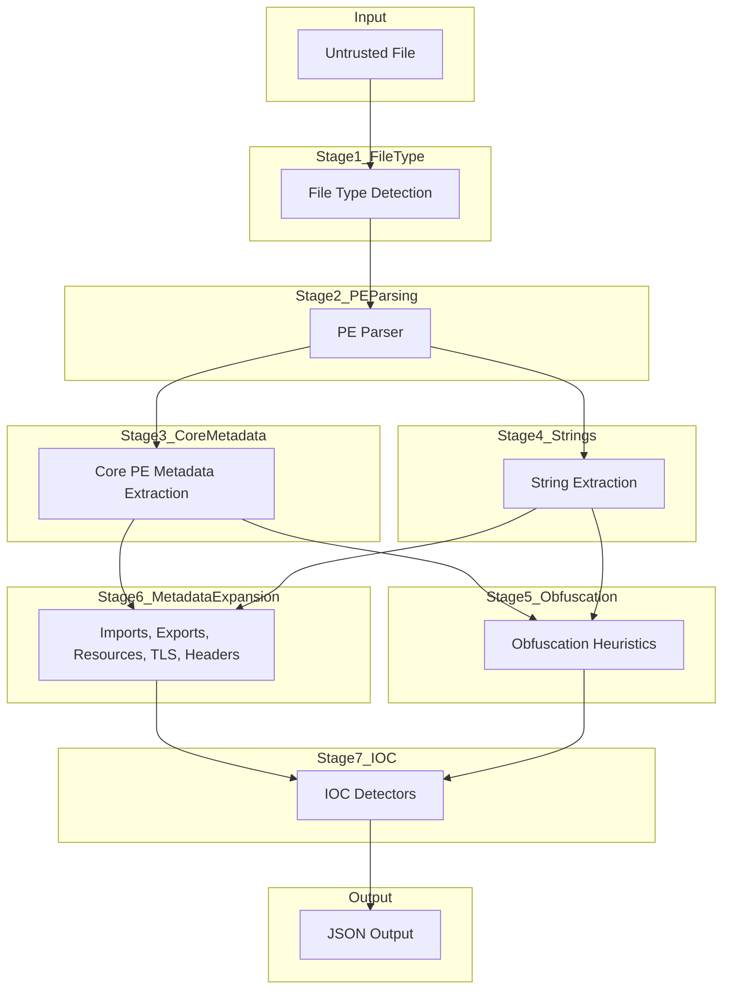

# IOCX PE Analysis Pipeline

IOCX includes a deterministic, static, offline analysis pipeline for Portable Executable (PE) files.
The pipeline is designed to safely process untrusted binaries without executing them, unpacking them, or performing any dynamic analysis. All stages operate on raw bytes only and are fully deterministic.

This document describes the PE pipeline as implemented in v0.6.0, including:

- file-type detection
- PE parsing
- core structural metadata extraction
- extended metadata extraction (v0.6.0)
- string extraction
- IOC detection
- output assembly

It also outlines how future versions (v0.7.0+) will extend this pipeline with behavioural heuristics.

## 1. Pipeline Overview

The PE analysis pipeline runs through the following ordered stages:

- File Type Detection
- PE Parsing
- Core Structural Metadata Extraction
- String Extraction
- Obfuscation Heuristics (v0.5.0)
- Extended Metadata Extraction (v0.6.0)
- IOC Detection
- Output Assembly

Each stage is offline, deterministic, and safe to run on malicious or malformed binaries.



## 2. File Type Detection

IOCX uses signature‑based identification to determine whether a file is a PE.

This step is:

- Structural only
- Non-heuristic
- Non-executing

If the file is not a PE, the PE pipeline is skipped.

## 3. PE Parsing

IOCX parses the binary using a defensive, read-only approach. The parser extracts:

- DOS header
- NT headers
- Optional header
- Section table
- Data directory pointers

All parsing is wrapped in exception handling to avoid crashes on malformed samples.

No dynamic loading or execution occurs.

## 4. Core Structural Metadata Extraction

This stage extracts the minimal structural information required by downstream components. These values appear in the final JSON under `metadata.header` and `metadata.sections`.

Core metadata includes:

- entry point
- timestamp
- machine type
- characteristics flags
- section names

When basic analysis is enabled, IOCX also extracts:

- section sizes
- virtual vs raw size

This metadata is used by both the obfuscation heuristics (v0.5.0) and the extended metadata module (v0.6.0).

## 5. String Extraction

IOCX extracts printable ASCII and UTF‑16LE strings from:

- `.text`
- `.rdata`
- `.data`
- entire file (fallback)

Extracted strings feed into:

- IOC detection
- obfuscation heuristics
- resource string extraction

Extraction is deterministic and bounded.

## 6. Obfuscation Heuristics (v0.5.0)

This module provides lightweight static hints about potential packing or obfuscation.

Heuristics include:

- suspicious section names (`.upx`, `.aspack`, `.mpress`, etc.)
- high‑entropy sections
- abnormal section layout
- simple string‑obfuscation patterns

### Output

Each heuristic emits a structured detection object:

```json
{
  "type": "obfuscation_hint",
  "value": "high_entropy_section",
  "metadata": {
    "section": ".upx0",
    "entropy": 7.89,
    "threshold": 7.2
  }
}
```

These hints are contextual, not behavioural.

## 7. PE Metadata Extraction (v0.6.0)

v0.6.0 introduces a comprehensive metadata extraction layer that extracts rich PE structural information.

This module is descriptive only — no scoring, no packer detection, no heuristics.

### 7.1 Import Table

Extracts:

- DLL names
- imported functions
- ordinals
- delayed imports
- bound imports

### 7.2 Export Table

Extracts:

- exported names
- ordinals
- forwarded exports

### 7.3 Resource Directory

Extracts:

- resource types (e.g., `RT_STRING`, `RT_ICON`, `RCDATA`)
- resource sizes
- resource entropy
- language codes and safe region-locale mapping

### 7.4 TLS Directory (Raw)

Extracts:

- start address
- end address
- callback table pointer
- No heuristics are applied in v0.6.0.

### 7.5 Header and Optional Header Fields

Extracts:

- entry point
- image base
- subsystem
- timestamp
- machine type
- characteristics
- section alignment
- file alignment
- size of image
- size of headers
- linked version
- OS version
- subsystem version

## 8. IOC Detection

After metadata extraction, IOCX runs its IOC detectors across:

- raw bytes
- extracted strings
- resource strings
- metadata fields

Detectors identify:

- file paths (Windows, UNC, Linux, env-var, relative)
- URLs
- domains
- IP addresses
- hashes
- email addresses
- cryptographic constants

Detection is static and deterministic.

## 9. Output Assembly

The engine merges:

- PE metadata
- obfuscation hints
- IOC detections

into a single structured JSON document, including:

- `file`
- `type`
- `iocs.*`
- `metadata.file_type`
- `metadata.imports`
- `metadata.sections`
- `metadata.resources`
- `metadata.resource_strings`
- `metadata.import_details`
- `metadata.delayed_imports`
- `metadata.bound_imports`
- `metadata.exports`
- `metadata.tls`
- `metadata.header`
- `metadata.optional_header`
- `metadata.rich_header`
- `metadata.signatures`
- `metadata.has_signature`

metadata.import_details

metadata.resources

metadata.resource_strings

metadata.tls

metadata.signatures

iocs.*

```json
{
  "detections": [
    { "type": "pe_metadata", "value": "import", ... },
    { "type": "obfuscation_hint", "value": "high_entropy_section", ... },
    { "type": "ioc", "value": "url", ... }
  ]
}
```

No network access or external lookups occur.

## 10. Security Model

The PE pipeline is designed for safe analysis of untrusted input:

- no execution
- no unpacking
- no emulation
- no dynamic imports
- no network calls
- no ML/AI models
- deterministic, offline processing

All analysis is read-only.

## 11. Roadmap Alignment

### v0.5.0 — Obfuscation Heuristics

- section names
- entropy
- layout anomalies
- string obfuscation

### v0.6.0 — Extended Metadata (this document)

- imports
- exports
- resources
- TLS directory
- extended headers
- signature presence

### v0.7.0 — Behavioural Heuristics (future)

- packer detection
- TLS callback heuristics
- anti‑debug heuristics
- import anomaly scoring
- signature anomalies
- control‑flow hints

v0.6.0 provides the structural foundation for v0.7.0.

## 12. Summary

The IOCX PE pipeline in v0.6.0 is:

- static
- deterministic
- offline
- safe
- modular
- extensible

It significantly expands IOCX’s visibility into PE structure while preserving its core philosophy:
no dynamic analysis, no risk, no surprises.
