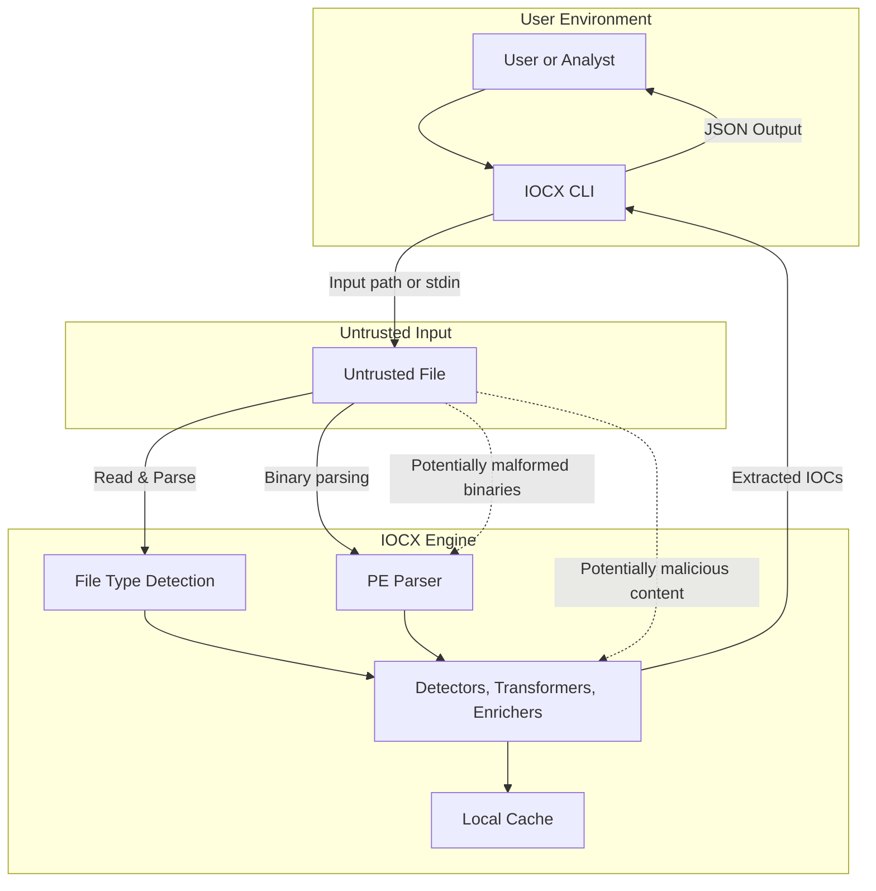
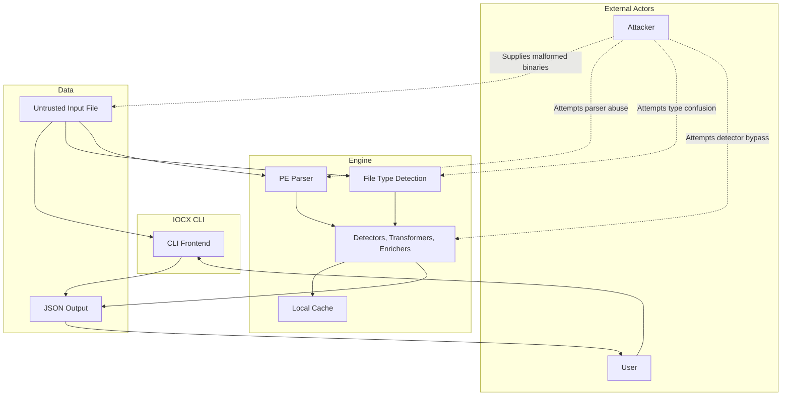

# Threat Model Overview

The following diagrams illustrate the IOCX security model, focusing on how untrusted data flows through the system and where potential threats may arise. IOCX is designed to process hostile input safely, so understanding these boundaries helps clarify the project’s defensive posture.

IOCX operates as a static extraction tool: it does not execute binaries, load external code, or perform dynamic analysis. The attack surface is intentionally small, with strict parsing, minimal dependencies, and no network access.

## Data-Flow Diagram (DFD)

This diagram shows the major components involved when IOCX processes untrusted input. It highlights the trust boundaries between the user environment, the IOCX engine, and the untrusted data being analysed.

- **User Environment** represents the analyst invoking the CLI.
- **Untrusted Input** includes any file provided to IOCX—text, logs, binaries, or potentially malicious samples.
- **IOCX Engine** contains the detectors, parsers, and supporting components that operate on the input.

Threat indicators show where malformed or malicious content may attempt to influence the system.

## STRIDE‑Oriented Threat Interaction Diagram

This diagram expands the model to include an explicit attacker. It illustrates how an adversary might attempt to exploit the system by supplying malformed binaries, abusing parsers, or attempting to bypass detectors.

The diagram also shows the flow of data through the CLI, engine, and output stages, making it clear where IOCX must remain defensive.

Key points:

- Attackers interact **only** through untrusted input files.
- IOCX performs **no dynamic execution**, reducing risk.
- All parsing is done in user space with strict error handling.
- Output is deterministic JSON with no side effects.

### 1. IOCX CLI

| STRIDE | Threat                  | Description                                                | Mitigation                                                             |
|--------|-------------------------| -----------------------------------------------------------|------------------------------------------------------------------------|
| **S**  | Spoofing                | Attacker pretends to be a legitimate user invoking the CLI | IOCX relies on OS‑level authentication; no internal identity system    |
| **T**  | Tampering               | Manipulation of CLI arguments or environment               | Defensive parsing; no privileged operations; no dynamic code execution |
| **R**  | Repudiation             | User denies running IOCX                                   | Local‑only tool; no sensitive logging                                  |
| **I**  | Information Disclosure  | CLI prints sensitive data                                  | Output is deterministic JSON; no internal state leakage                |
| **D**  | Denial of Service       | Attacker supplies huge or malformed input                  | Timeouts; strict parsing; exception handling                           |
| **E**  | Elevation of Privilege  | CLI used to escalate privileges                            | Runs entirely in user space; no privileged operations                  |

### 2. Untrusted Input (Files, Logs, Binaries)

| STRIDE | Threat                 | Description                                        | Mitigation                                   |
|--------|------------------------|----------------------------------------------------|----------------------------------------------|
| **S**  | Spoofing               | Fake file types                                    | Signature‑based detection via python‑magic   |
| **T**  | Tampering              | Malformed binaries crafted to break parsers        | Defensive parsing; try/except wrappers       |
| **R**  | Repudiation            | Attacker denies supplying malicious file           | Out of scope; IOCX does not track provenance |
| **I**  | Information Disclosure | Sensitive data inside files                        | IOCX does not transmit or store data         |
| **D**  | Denial of Service      | Zip bombs, oversized binaries, pathological inputs | Bounded parsing; timeouts                    |
| **E**  | Elevation of Privilege | Malicious file triggers code execution             | No execution, no deserialization, no eval    |

### 3. File Type Detection (python‑magic)

| STRIDE | Threat                 | Description                            | Mitigation                            |
|--------|------------------------|----------------------------------------|---------------------------------------|
| **S**  | Spoofing               | File claims incorrect MIME type        | Signature‑based detection             |
| **T**  | Tampering              | Malformed headers crash detection      | Exception handling; safe fallback     |
| **R**  | Repudiation            | Incorrect type classification          | Non‑security‑critical; local‑only     |
| **I**  | Information Disclosure | Revealing internal detection logic     | No sensitive data; local‑only         |
| **D**  | Denial of Service      | Crafted files cause excessive scanning | Bounded reads; timeouts               |
| **E**  | Elevation of Privilege | Exploiting python‑magic                | Minimal dependency; audited regularly |

### 4. PE Parser (pefile)

| STRIDE | Threat                 | Description                                     | Mitigation                             |
|--------|------------------------|-------------------------------------------------|----------------------------------------|
| **S**  | Spoofing               | Fake PE headers                                 | Structural validation by pefile        |
| **T**  | Tampering              | Malformed PE triggers parser bugs               | Defensive parsing; try/except wrappers |
| **R**  | Repudiation            | Incorrect parsing results                       | Local‑only; no persistence             |
| **I**  | Information Disclosure | Extracting sensitive metadata                   | Output is user‑controlled              |
| **D**  | Denial of Service      | Malformed PE causing recursion or heavy parsing | Timeouts; bounded parsing              |
| **E**  | Elevation of Privilege | Exploiting pefile                               | No execution of PE content             |

### 5. Detectors / Transformers / Enrichers

| STRIDE | Threat                 | Description                          | Mitigation                              |
|--------|------------------------|--------------------------------------|-----------------------------------------|
| **S**  | Spoofing               | Fake IOC patterns                    | Deterministic regex‑based detection     |
| **T**  | Tampering              | Malicious input breaks detectors     | Strict parsing; no dynamic code         |
| **R**  | Repudiation            | Incorrect detection results          | Local‑only; no persistence              |
| **I**  | Information Disclosure | Extracted IOCs reveal sensitive data | User controls output; no network access |
| **D**  | Denial of Service      | Regex backtracking attacks           | Pre‑compiled safe regex patterns        |
| **E**  | Elevation of Privilege | Plugin system abused                 | ``--dev`` mode opt‑in; no auto‑loading  |

#### **Third‑Party Components (Domain Decoding)**

IOCX uses the `idna` library for punycode decoding and Unicode domain normalization. This expands the dependency surface slightly, but the risk profile remains low:

- Pure‑Python implementation with no native extensions
- No network access or external lookups
- Deterministic transformations only
- Widely used across the Python ecosystem
- Included in adversarial testing for malformed punycode, invalid labels, and Unicode edge cases

**Threat considerations:**

| STRIDE | Threat                 | Description                                             | Mitigation                                                                  |
|--------|------------------------|---------------------------------------------------------|-----------------------------------------------------------------------------|
| **S**  | Spoofing               | Unicode domains crafted to appear visually similar      | Confusable detection; script classification; punycode round‑trip validation |
| **T**  | Tampering              | Malformed punycode strings attempting to break decoding | Exception handling; bounded decoding; adversarial fixtures                  |
| **R**  | Repudiation            | Incorrect decoding results                              | Deterministic transformations; snapshot tests                               |
| **I**  | Information Disclosure | None — no external communication                        | Local‑only processing                                                       |
| **D**  | Denial of Service      | Extremely long or malformed labels                      | Length caps; strict punycode validation                                     |
| **E**  | Elevation of Privilege | None — no execution or dynamic loading                  | Pure‑function transformations only                                          |

### 6. Local Cache

| STRIDE | Threat                 | Description                   | Mitigation                                   |
|--------|------------------------|-------------------------------|----------------------------------------------|
| **S**  | Spoofing               | Cache poisoning               | Cache is local and ephemeral                 |
| **T**  | Tampering              | Attacker modifies cache files | Cache disabled by default; no sensitive data |
| **R**  | Repudiation            | Cache state disputes          | Cache is non‑persistent                      |
| **I**  | Information Disclosure | Cache leaks sensitive data    | Cache stores only extraction metadata        |
| **D**  | Denial of Service      | Cache grows unbounded         | Cache is small and optional                  |
| **E**  | Elevation of Privilege | Cache used to load code       | Cache stores no executable content           |

### 7. JSON Output

| STRIDE | Threat                 | Description                             | Mitigation                                 |
|--------|------------------------|-----------------------------------------|--------------------------------------------|
| **S**  | Spoofing               | Fake output injected                    | Output is deterministic; no external input |
| **T**  | Tampering              | Output modified in transit              | Local‑only; user controls destination      |
| **R**  | Repudiation            | User denies output                      | Out of scope; no logging                   |
| **I**  | Information Disclosure | Sensitive IOCs exposed                  | User controls output file                  |
| **D**  | Denial of Service      | Huge output from pathological input     | Bounded extraction                         |
| **E**  | Elevation of Privilege | Output used to trigger downstream tools | JSON only; no executable content           |

## How These Diagrams Fit Into IOCX’s Security Posture

These diagrams support the project’s security goals by:

- Defining clear trust boundaries
- Identifying where untrusted data enters the system
- Highlighting components that must be hardened
- Demonstrating that IOCX avoids high‑risk behaviours (execution, deserialization, network access)
- Providing transparency for auditors, contributors, and users

Together, they form the foundation of IOCX’s threat model and help guide secure development practices.

# PE Metadata Expansion (v0.6.0)

IOCX v0.6.0 introduces a deterministic, static metadata extraction layer for Portable Executable (PE) files.
This feature expands IOCX’s visibility into binary structure while maintaining strict security guarantees:

- No dynamic analysis
- No unpacking or emulation
- No network access
- No heavy dependencies
- Fully deterministic and offline

This metadata is used to provide analysts with richer context and to support future heuristic layers (v0.7.0).

## What IOCX Extracts

### 1. Import Table

IOCX extracts:

- DLL names
- Imported functions
- Ordinal imports
- Delayed imports
- Bound imports

This information helps analysts understand API usage and identify unusual import patterns.

### 2. Export Table

IOCX extracts:

- Exported function names
- Ordinals
- Forwarded exports

This is useful for triaging DLLs and identifying suspicious export structures.

### 3. Resource Directory

IOCX extracts:

- Resource types (icons, dialogs, version info, RCDATA)
- Resource sizes
- Resource entropy
- Language codes (mapped to region-locale)

High‑entropy resources may indicate embedded payloads or obfuscation.

> Language codes are mapped to human‑readable locale identifiers using a minimal, safe lookup table. Only well‑defined primary language IDs and a small set of explicit region codes are resolved; ambiguous or non‑standard values are returned as "unknown" to avoid misclassification.

### 4. Extended PE Metadata

IOCX surfaces:

- Timestamp
- Subsystem
- Machine type
- Characteristics flags
- Optional header fields
- Entry point
- Image base
- Section alignment
- Compiler/toolchain hints
- Digital signature presence (raw only)
- TLS directory (raw only)

This metadata provides a structural overview of the binary without making behavioural claims.

## Security Considerations

- All analysis is read‑only and non‑invasive
- No code execution occurs at any stage
- All parsing is wrapped in defensive exception handling
- No external lookups or network calls are performed
- All entropy and size calculations are deterministic

This ensures IOCX remains safe to use on untrusted or malicious binaries.

## Relationship to v0.7.0

v0.6.0 is descriptive only.
It extracts facts but does not interpret them.

Heuristics such as:

- packer detection
- anti‑debug detection
- TLS callback analysis
- import anomaly scoring
- signature anomaly detection
- control‑flow hints

are explicitly reserved for v0.7.0, which will build on the metadata introduced here.
