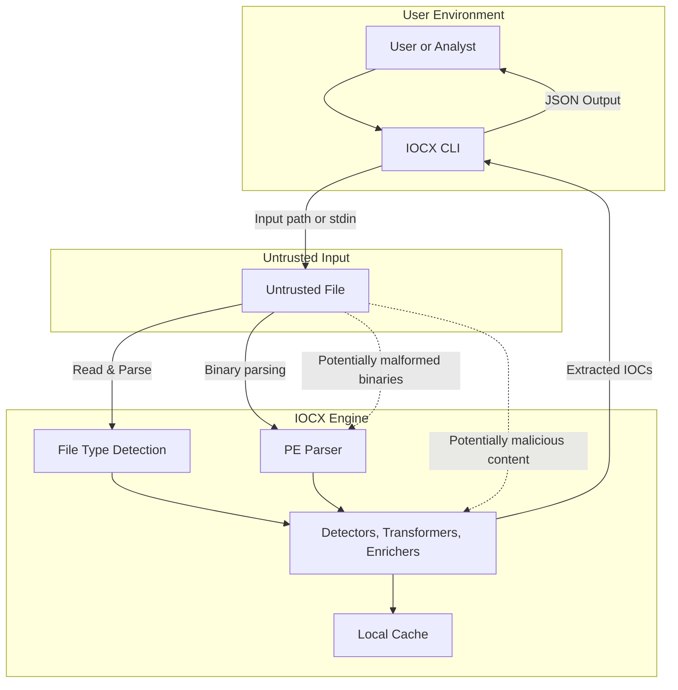
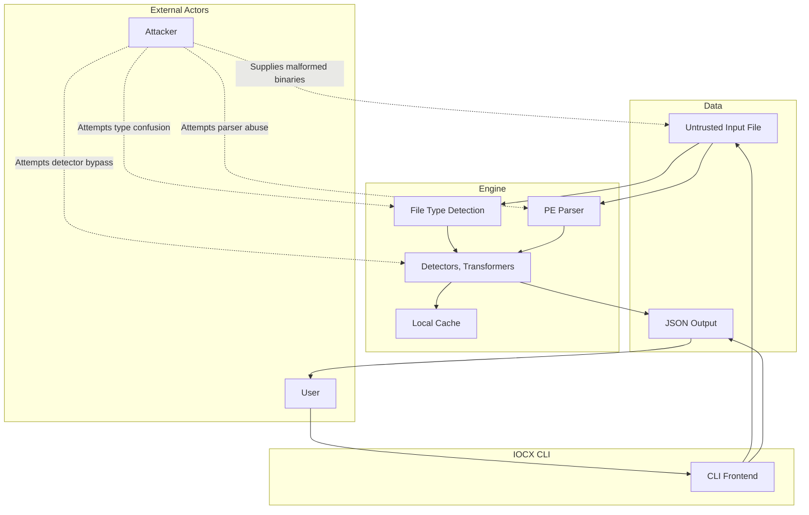

```mermaid
flowchart TD

    subgraph User Environment
        U[User or Analyst]
        CLI[IOCX CLI]
    end

    subgraph IOCX Engine
        DET[Detectors, Transformers, Enrichers]
        PE[PE Parser]
        MAGIC[File Type Detection]
        CACHE[Local Cache]
    end

    subgraph Untrusted Input
        F[Untrusted File]
    end

    U --> CLI
    CLI -->|Input path or stdin| F
    F -->|Read & Parse| MAGIC
    F -->|Binary parsing| PE
    MAGIC --> DET
    PE --> DET
    DET --> CACHE
    DET -->|Extracted IOCs| CLI
    CLI -->|JSON Output| U

    %% Threat Indicators
    F -. Potentially malicious content .-> DET
    F -. Potentially malformed binaries .-> PE

```

```mermaid
flowchart TD

    subgraph External Actors
        A[Attacker]
        U[User]
    end

    subgraph IOCX CLI
        CLI[CLI Frontend]
    end

    subgraph Engine
        DET[Detectors, Transformers]
        PE[PE Parser]
        MAGIC[File Type Detection]
        CACHE[Local Cache]
    end

    subgraph Data
        F[Untrusted Input File]
        O[JSON Output]
    end

    %% Data Flows
    U --> CLI
    CLI --> F
    F --> MAGIC
    F --> PE
    MAGIC --> DET
    PE --> DET
    DET --> CACHE
    DET --> O
    CLI --> O
    O --> U

    %% Threats
    A -. Supplies malformed binaries .-> F
    A -. Attempts parser abuse .-> PE
    A -. Attempts type confusion .-> MAGIC
    A -. Attempts detector bypass .-> DET
```
