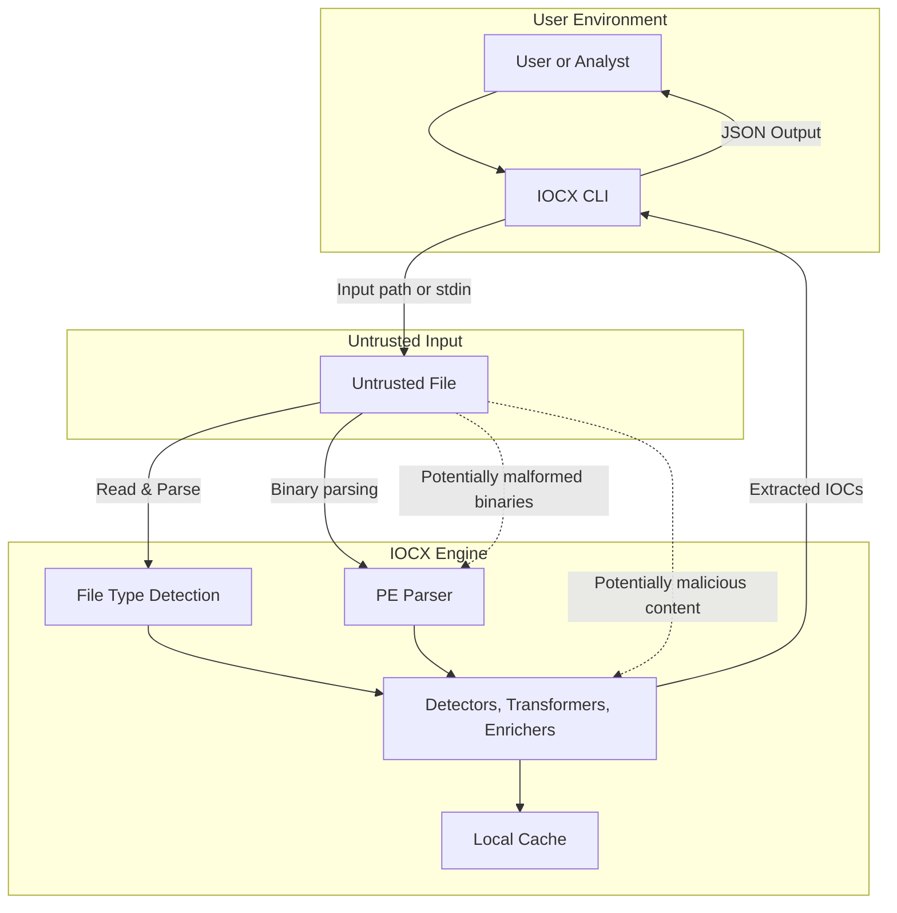
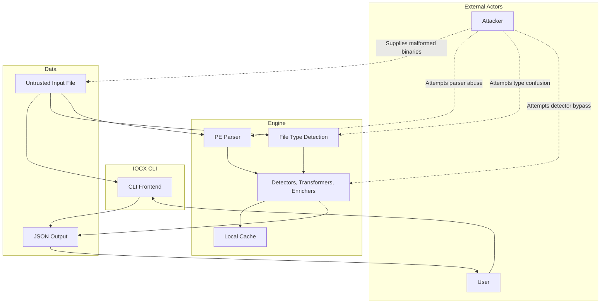

# Threat Model Overview

The following diagrams illustrate the IOCX security model, focusing on how untrusted data flows through the system and where potential threats may arise. IOCX is designed to process hostile input safely, so understanding these boundaries helps clarify the project’s defensive posture.

IOCX operates as a static extraction tool: it does not execute binaries, load external code, or perform dynamic analysis. The attack surface is intentionally small, with strict parsing, minimal dependencies, and no network access.

## Data-Flow Diagram (DFD)

This diagram shows the major components involved when IOCX processes untrusted input. It highlights the trust boundaries between the user environment, the IOCX engine, and the untrusted data being analysed.

- **User Environment** represents the analyst invoking the CLI.
- **Untrusted Input** includes any file provided to IOCX—text, logs, binaries, or potentially malicious samples.
- **IOCX Engine** contains the detectors, parsers, and supporting components that operate on the input.

Threat indicators show where malformed or malicious content may attempt to influence the system.

## STRIDE‑Oriented Threat Interaction Diagram

This diagram expands the model to include an explicit attacker. It illustrates how an adversary might attempt to exploit the system by supplying malformed binaries, abusing parsers, or attempting to bypass detectors.

The diagram also shows the flow of data through the CLI, engine, and output stages, making it clear where IOCX must remain defensive.

Key points:

- Attackers interact **only** through untrusted input files.
- IOCX performs **no dynamic execution**, reducing risk.
- All parsing is done in user space with strict error handling.
- Output is deterministic JSON with no side effects.

## How These Diagrams Fit Into IOCX’s Security Posture

These diagrams support the project’s security goals by:

- Defining clear trust boundaries
- Identifying where untrusted data enters the system
- Highlighting components that must be hardened
- Demonstrating that IOCX avoids high‑risk behaviours (execution, deserialization, network access)
- Providing transparency for auditors, contributors, and users

Together, they form the foundation of IOCX’s threat model and help guide secure development practices.
